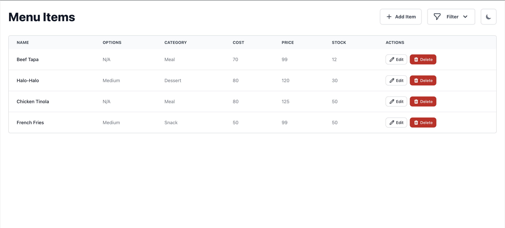

# Simple Menu Item CRUD App

An application used to add, view, edit and delete items in your menu, built with React, Redux Toolkit, JavaScript, Formik with Yup, TailwindCSS with Flowbite for React.

## Project Screen Shots Light and Dark

## Installation and Setup Instructions

Clone down this repository. You will need `node` and `npm` installed globally on your machine.

Installation:

`npm install`

To Start Server:

`npm start`

To Visit App:

`localhost:3000/`

## Important 3rd Party libraries used

- Flowbite and Flowbite React (https://www.flowbite-react.com/docs/getting-started/quickstart)

- Redux and Redux Toolkit (https://redux-toolkit.js.org/tutorials/quick-start)

- Formik and Yup (https://formik.org/docs/tutorial) (https://formik.org/docs/guides/validation)

- Firebase Realtime Database (https://firebase.google.com/docs/database/web/start)

- Sonner (https://sonner.emilkowal.ski/)

## Reflections

- Improved my understanding with state management both local(useState) and global(redux toolkit).
- Been using mostly Bootstrap but came to like Tailwind now and able to discover Flowbite for react for easier app design and theme.
- It was hard to manage forms but thankfully found Formik and Yup to validate the inputs and stop my tears in managing form state.
- Firebse realtime database is awesome for projects like this or maybe even bigger ones but needs to properly structure the data which I will look more closely next time.
